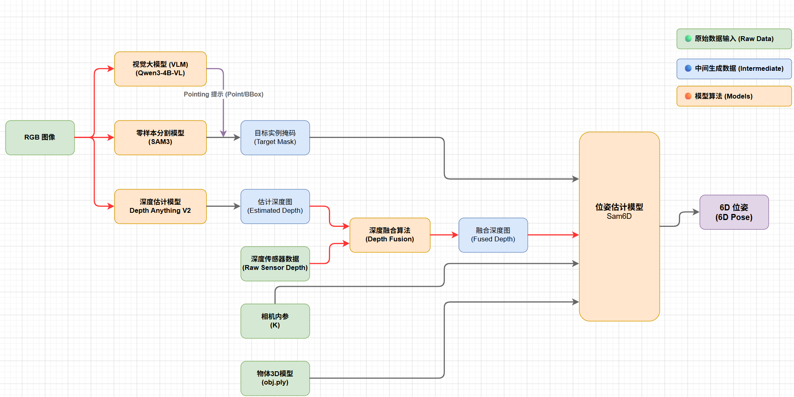

# Gen6D

面向工业抓取场景的 **6D 位姿估计** 与 **标记位附近抓取点** 方案：融合传感器深度与大模型估计深度，结合 SAM3 分割 / SAM-6D 位姿，输出相机坐标系下的 6D 位姿或夹爪抓取点 `q`。



## 快速开始

```bash
cd /home/ubuntu/stephen/01-code/Gen6D
bash start.sh restart    # 默认 :8000；可用 DEVICE=cpu
```

| 入口 | URL |
|------|-----|
| Web UI | `http://<host>:8000/ui` |
| API Docs | `http://<host>:8000/docs` |

配置见 `config/grasp_config.json`（SAM3 / SAM-6D / 标记位 place 默认项）。

### Web UI 页签

| 页签 | 作用 |
|------|------|
| **深度估计** | 传感器深度 + DA3 估计 + 融合深度可视化 / 点云 |
| **SAM3 分割** | 实例分割 + 标记位 P1 → 抓取点 `q`（`xyzrxryrz`） |
| **融合深度 + SAM-6D** | 融合或传感器深度 → SAM-6D（`seg_backend=sam3`）6D 位姿 |

详细流程见 [doc/sam3_seg_tab.md](doc/sam3_seg_tab.md)。

---

## 近期更新（摘要）

相对早期「仅深度融合」骨架，近期主要落地：

1. **SAM-6D 对接**（`5d94a48`）  
   - UI 调用 SAM-6D `POST /infer`（form：`seg_backend=sam3` 等）  
   - 可选深度来源：融合深度 / 原始传感器深度  
   - 文档：[doc/sam6d_rest_api.md](doc/sam6d_rest_api.md)、[doc/pem.md](doc/pem.md)

2. **SAM3 分割 Tab**（`55236af`）  
   - 传感器深度实例分色点云；绿色标记位 → **P1**（PEM 同款几何）  
   - 每实例：`p_i`（Z 最小）→ 预览 P1 / 实例点

3. **抓取点 q + 预览拆分**（`2c59e71`）  
   - `p_i` 后取相机系 `|y−p_i.y|≤2mm` 聚合中心 **`q_i`**；按 P1-X `|dx|` **只保留最近 1 个** 作为夹爪抓取点  
   - UI JSON：`[x,y,z,rx,ry,rz]`（xyz=mm，姿态=°）  
   - 实例分割预览拆成 **mask** / **bbox** 两张图（SAM3 Tab 与 SAM-6D ISM 均已支持）

---

## 背景与动机

在电子料盘、反光/半透明塑料等工业场景中，纯传感器深度或纯视觉深度估计均存在致命短板：

| 方案 | 优势 | 痛点 |
|------|------|------|
| **传感器深度**（结构光 / ToF） | 物理尺度准确 | 反光、透明材质导致大面积深度丢失（"黑洞"），缺失区域往往在物体边缘——正是 6D 位姿所需的关键几何特征 |
| **深度估计模型**（Depth Anything V2 等） | 泛化强、边缘完整 | 多为相对深度，绝对尺度（Scale）与平移（Shift）难以满足毫米级抓取精度 |

**结论：采用「传感器定尺度 + 大模型补残缺」的融合方案。**

---

## 整体 Pipeline

```
RGB 图像 ──┬──► 分割模型 (YOLO / SAM2) ──► 分割掩码 ──────────────┐
           │                                                      │
           ├──► 深度估计模型 (Depth Anything V2 / LingBot Depth) │
           │         │                                              │
           │         ▼                                              │
           │    估计深度图 ──► 深度融合算法 ◄── 传感器原始深度       │
           │                      │                                │
           │                      ▼                                │
           │                 融合深度图 ────────────────────────────┤
           │                                                      │
           └──────────────────────────────────────────────────────┤
                                                                  ▼
                    相机内参 K + 物体 3D 模型 (obj/ply) ──► 位姿估计模型 ──► 6D 位姿
                                                         (FoundationPose /
                                                          Sam6D / GraspNet /
                                                          Genpose2)
```

### 输入（原始数据）

| 输入 | 说明 |
|------|------|
| RGB 图像 | 彩色相机采集 |
| 传感器深度 | 结构光 / ToF 等物理深度 |
| 相机内参 K | 焦距、主点等标定参数 |
| 物体 3D 模型 | CAD 模型，格式 obj / ply |

### 中间产物

| 产物 | 来源 |
|------|------|
| 分割掩码 | YOLO / SAM2 |
| 估计深度图 | Depth Anything V2 / LingBot Depth 2.0 |
| 融合深度图 | 深度融合算法（见下文） |

### 输出

- **6D 位姿**（SAM-6D）：物体相对于相机的旋转 + 平移  
- **抓取点 q**（SAM3 分割 Tab）：`[x, y, z, rx, ry, rz]`  
  - `x,y,z`：相机系位置，单位 **mm**  
  - `rx,ry,rz`：姿态，单位 **°**（由 P1 旋转按 ZYX 欧拉角换算）

---

## 深度融合算法（核心）

传感器数据作为 **物理锚点**，大模型估计作为 **几何填充**。

### Step 1：尺度对齐（Scale & Shift Alignment）

在传感器有效像素（非黑洞区域）上，用最小二乘或 RANSAC 求解全局缩放 `s` 与平移 `t`：

```
D_metric_est = s · D_est + t
```

将对齐后的估计深度映射到传感器物理度量空间。

### Step 2：掩码替换与引导滤波融合

| 区域 | 策略 |
|------|------|
| 传感器高置信度区域 | **保留**原始传感器深度 |
| 深度缺失（黑洞）区域 | 用对齐后的 `D_metric_est` **填补** |
| 边界过渡 | 以 RGB 为引导，使用 Guided Filter / Joint Bilateral Filter 平滑，避免深度跳变影响法线计算 |

### Step 3：赋能下游位姿估计

- **初始位姿**：融合后的完整点云送入 FoundationPose 等 Render-and-Compare 框架，提升假设生成成功率
- **位姿精细化（ICP）**：传感器真实点赋予更高权重，模型填补点赋予较低权重——兼顾完整性与物理精度

---

## 文档索引

| 文档 | 说明 |
|------|------|
| [doc/sam3_seg_tab.md](doc/sam3_seg_tab.md) | **SAM3 分割 Tab**：P1 / p_i / q_i / 抓取位姿 |
| [doc/grasp_api.md](doc/grasp_api.md) | **REST** `POST /api/v1/infer/grasp`（返回 `xyzrxryrz` + 可视化图） |
| [doc/sam6d_rest_api.md](doc/sam6d_rest_api.md) | SAM-6D HTTP 服务 REST |
| [doc/pem.md](doc/pem.md) | PEM / SAM-6D 集成说明 |
| [doc/depth_fusion.md](doc/depth_fusion.md) | 深度融合细节 |
| [doc/接口文档.md](doc/接口文档.md) | Gen6D 本仓深度预测 API |
| [doc/da_basic_usage.md](doc/da_basic_usage.md) | Depth Anything 基础用法 |

主要代码：

```
src/depth/          # 深度估计、融合、点云
src/grasp/          # UI Tab、SAM3/SAM-6D 客户端、标记位与抓取点
config/grasp_config.json
prompt/             # SAM3 / 标记位 / VLM 提示词
```

---

## 路线图（早期规划，部分已完成）

> 下列 Phase 为立项时的检查清单；深度融合、SAM3、SAM-6D、抓取点 q 等已在 UI 中可用，未勾选项表示仍可继续加强。

### Phase 0：环境与数据准备

- [ ] **0.1** 搭建 Python 开发环境（建议 PyTorch + CUDA）
- [ ] **0.2** 准备测试数据集：RGB 图像 + 传感器深度 + 相机内参 K + 目标物体 CAD 模型
- [ ] **0.3** 标注或采集若干帧 ground-truth 6D 位姿（用于后续评估，可选但强烈建议）
- [ ] **0.4** 初始化项目目录结构（建议）：

```
Gen6D/
├── data/              # 原始数据与标注
├── models/            # 各模型权重与配置
├── src/
│   ├── segmentation/  # 分割模块
│   ├── depth/         # 深度估计 + 融合
│   ├── pose/          # 位姿估计
│   └── utils/         # 相机、点云、可视化工具
├── configs/           # 超参与模型选型配置
├── scripts/           # 推理与评估入口
└── doc/
```

---

### Phase 1：分割模块

- [ ] **1.1** 选型并部署分割模型：**YOLO**（速度快，适合已知类别）或 **SAM2**（零样本，适合新物体）
- [ ] **1.2** 实现 `RGB → 分割掩码` 推理接口，输出与 RGB 同分辨率的 binary mask
- [ ] **1.3** 在料盘场景数据上验证掩码质量（边缘是否贴合、遮挡处理是否合理）

---

### Phase 2：深度估计模块

- [ ] **2.1** 部署深度估计模型：**Depth Anything V2** 或 **LingBot Depth 2.0**
- [ ] **2.2** 实现 `RGB → 估计深度图` 推理接口
- [ ] **2.3** 可视化对比：估计深度 vs 传感器深度，确认黑洞区域可被模型补全

---

### Phase 3：深度融合模块（本项目核心）

- [ ] **3.1** 实现传感器有效深度掩码生成（过滤无效值 / 低置信度像素）
- [ ] **3.2** 实现 Scale & Shift 对齐（最小二乘 + RANSAC 鲁棒拟合）
- [ ] **3.3** 实现掩码替换融合：有效区保留传感器，黑洞区填入对齐估计
- [ ] **3.4** 实现 Guided Filter / Joint Bilateral Filter 边界平滑
- [ ] **3.5** 融合深度 → 点云转换（需 K），可视化验证边缘连续性与物理尺度
- [ ] **3.6** 编写单元测试：对齐精度、融合边界、点云完整性

---

### Phase 4：位姿估计模块

- [ ] **4.1** 选型位姿估计框架（推荐优先尝试 **FoundationPose**，备选 Sam6D / Genpose2 / GraspNet）
- [ ] **4.2** 对接输入：RGB + 分割掩码 + 融合深度图 + K + 物体 3D 模型
- [ ] **4.3** 实现 6D 位姿输出格式（4×4 变换矩阵或 R + t）
- [ ] **4.4** 若框架支持 ICP 精细化，配置传感器点高权重策略

---

### Phase 5：Pipeline 集成与评估

- [ ] **5.1** 编写端到端推理脚本：`scripts/run_pipeline.py`
- [ ] **5.2** 串联 Phase 1–4，统一配置管理（`configs/`）
- [ ] **5.3** 建立评估指标：ADD、ADD-S、旋转/平移误差、推理耗时
- [ ] **5.4** 在完整料盘场景上跑通并记录 baseline 结果
- [ ] **5.5** 对比实验：纯传感器深度 vs 纯估计深度 vs 融合深度 → 位姿精度

---

### Phase 6：工程化（可选，部署阶段）

- [ ] **6.1** 模型推理加速（TensorRT / ONNX）
- [ ] **6.2** 与机械臂 / 视觉系统 SDK 对接
- [ ] **6.3** 实时性优化与异常处理（深度全丢失、分割失败等 fallback）

---

## 建议优先级

```
Phase 0 → Phase 3（深度融合，核心差异化）→ Phase 2 → Phase 1 → Phase 4 → Phase 5
```

**理由**：深度融合是本方案的核心价值；可先用固定掩码或手工 mask 绕过 Phase 1，用预训练深度模型快速验证 Phase 2/3，再接入完整 pipeline。

---

## 参考

- 方案设计图：[doc/pipeline.png](doc/pipeline.png)
- SAM3 抓取点：[doc/sam3_seg_tab.md](doc/sam3_seg_tab.md)
- 深度融合：[doc/depth_fusion.md](doc/depth_fusion.md)
