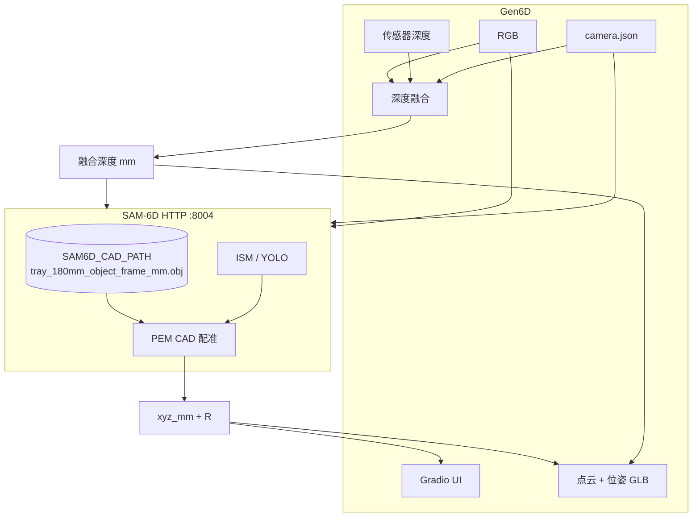

# PEM 位姿估计方案（SAM-6D + CAD）

Gen6D 抓取/放置链路中，**6D 位姿估计（PEM）** 的目标对象为主产线 **180 mm 圆盘料盘**。本文档说明如何从 **GenPose2（无 CAD）** 迁移到 **SAM-6D HTTP 服务（CAD 配准）**，以及 Gen6D 侧如何对接。

相关文档：

- [SAM-6D REST API](sam6d_rest_api.md) — **位姿估计后端接口（主参考）**
- [深度融合方案](depth_fusion.md) — 融合深度 `D_fused` 作为 `/infer` 的 depth 输入
- [Gen6D REST API](接口文档.md) — 深度推理 HTTP 接口

---

## 1. 背景与决策

### 1.1 业务对象

| 项目 | 说明 |
|------|------|
| 物体 | 白色塑料圆盘料盘（卷盘），直径约 **180 mm** |
| 默认 CAD | `/home/ubuntu/stephen/01-code/Gen6D/CAD_model/tray_180mm_object_frame_mm.obj` |
| 观测 | RGB-D 相机，常只能看到 **部分点云**（遮挡、视角、透明/反光） |
| Gen6D 预处理 | DA3 **深度融合** → 度量深度（mm） |

### 1.2 后端选型：SAM-6D 替代 GenPose2

| | GenPose2（现状，将废弃） | SAM-6D HTTP（目标） |
|---|-------------------------|---------------------|
| CAD | ❌ 不使用 | ✅ 服务端 `SAM6D_CAD_PATH` 加载 |
| 分割 | 外部 SAM3 mask → `seg_backend=provided` | 内置 **ISM**（SAM/FastSAM）或 **YOLO** |
| 位姿 | Category-level 扩散回归 | **CAD partial-to-partial PEM** |
| 接口 | `POST /infer` @ `:8002` | `POST /infer` @ `:8004`（见 [sam6d_rest_api.md](sam6d_rest_api.md)） |
| 请求体 | rgb + depth + camera + **mask** | rgb + depth + camera（**无 mask**） |

**结论**：180 mm 固定料盘 + 已有 CAD → **SAM-6D**；Gen6D 负责 **深度融合**，SAM-6D 负责 **分割 + CAD 配准位姿**。

---

## 2. 当前链路 vs 目标链路

### 2.1 当前（Gen6D 已实现，待替换）

```
RGB + 传感器深度 + camera.json
        │
        ▼
   DA3 + 深度融合 ──► D_fused (mm)
        │
        ▼
   SAM3（Point + 文本）──► instance mask
        │
        ▼
   GenPose2 POST /infer（:8002，seg_backend=provided，无 CAD）
        │
        ▼
   xyz_mm + rotation + size_3d（网络估计）
```

实现位置：`src/grasp/ui.py`、`src/grasp/pem.py`、`config/grasp_config.json`。

### 2.2 目标（SAM-6D）

```
RGB + 传感器深度 + camera.json
        │
        ▼
   DA3 + 深度融合 ──► D_fused (mm) ──► 保存为 depth.png（uint16 mm）
        │
        ▼
   SAM-6D POST /infer（:8004）
        │   ├─ 输入：rgb + depth + camera（multipart）
        │   └─ CAD：服务端 SAM6D_CAD_PATH（启动时配置，请求不上传）
        │
        ▼
   ISM / YOLO 分割 ──► PEM（CAD 配准）──► 最佳检测位姿
        │
        ▼
   xyz_mm + rotation_euler_zyx_rad + vis_pem.png
        │
        ▼
   Gen6D UI：GLB 点云 + 位姿轴 / 抓取偏移
```

**Gen6D 保留**：深度融合、Gradio UI、点云 GLB 可视化。  
**Gen6D 替换**：`src/grasp/pem.py` 客户端由 GenPose2 `:8002` 改为 SAM-6D `:8004`。  
**Gen6D 可选保留**：SAM3 + Point Tab 作 **人工预览 / 对照**（SAM-6D 自带分割，不再上传 mask）。

---

## 3. 默认 CAD 模型

### 3.1 路径（Gen6D 约定）

```
/home/ubuntu/stephen/01-code/Gen6D/CAD_model/tray_180mm_object_frame_mm.obj
```

| 属性 | 说明 |
|------|------|
| 格式 | OBJ（由 `scripts/process_cad_tray.py` 从原始 PLY 生成） |
| 单位 | **毫米（mm）** |
| 坐标系 | 原点 = bbox 中心；**+Y** = 卷轴厚度方向；盘面 ≈ **XZ** |
| 直径 | ≈ **183.5 mm**（mesh 实测，标称 180 mm） |
| 厚度 | ≈ **23 mm** |

原始源文件：`CAD_model/tray_180mm_centered_mesh_v2.ply`（勿直接给 PEM）。  
完整 processed 资产（含 `.ply`、表面点云 `.npy`）：`CAD_model/processed/tray_180mm/`。

### 3.2 SAM-6D 服务端 CAD 配置

SAM-6D **不在请求里上传 CAD**，启动时通过环境变量指定：

```bash
export SAM6D_CAD_PATH=/home/ubuntu/stephen/01-code/Gen6D/CAD_model/tray_180mm_object_frame_mm.obj
# 若服务仅接受 .ply，可使用同目录 processed 副本：
# export SAM6D_CAD_PATH=/home/ubuntu/stephen/01-code/Gen6D/CAD_model/processed/tray_180mm/tray_180mm_object_frame_mm.ply
```

更换 CAD 后调用 `POST /warmup` 刷新模板缓存（无需重启进程）。详见 [sam6d_rest_api.md](sam6d_rest_api.md)。

---

## 4. SAM-6D 接口对接（Gen6D → SAM-6D）

完整规范见 **[sam6d_rest_api.md](sam6d_rest_api.md)**。以下为 Gen6D 集成要点。

### 4.1 服务地址

| 接口 | 默认 URL |
|------|----------|
| 健康检查 | `GET http://<host>:8004/health` |
| 位姿推理 | `POST http://<host>:8004/infer` |
| 预热 | `POST http://<host>:8004/warmup` |

### 4.2 POST `/infer` 请求（Gen6D 侧构造）

**Content-Type：** `multipart/form-data`

| 字段 | 来源（Gen6D） | 说明 |
|------|---------------|------|
| `rgb` | UI 上传 RGB | 保存为 `rgb.png` |
| `depth` | **融合深度** `D_fused` | uint16 PNG，**单位 mm**（与 Gen6D 深度融合输出一致） |
| `camera` | `camera.json` | 含 `cam_K`（9 元）+ `depth_scale` |

`camera.json` 示例：

```json
{
  "cam_K": [fx, 0, cx, 0, fy, cy, 0, 0, 1],
  "depth_scale": 1.0
}
```

> Gen6D 深度融合已将深度转为 **mm**；写入 PNG 时需与 SAM-6D 约定的 `depth_scale` 一致（通常 `depth_scale=1.0` 表示 PNG 像素值即 mm）。

#### 可选查询参数

| 参数 | 建议 | 说明 |
|------|------|------|
| `seg_backend` | `sam6d_ism` 或 `yolo_seg` | 分割后端；YOLO 更快 |
| `segmentor_model` | `sam` | 仅 `sam6d_ism` 时：`sam` / `fastsam` |
| `det_score_thresh` | `0.3` | PEM 分数阈值（YOLO 模式下内部为 0） |

Gen6D 曾用 SAM3 Point 分割；迁移后 **SAM-6D 内置 ISM/YOLO**，一般 **不再传 mask**。UI 上 SAM3 可保留为可选对照。

### 4.3 响应（与 GenPose2 字段兼容部分）

Gen6D UI / `extract_pem_poses()` 可继续解析：

| 字段 | 说明 |
|------|------|
| `score` | 最佳检测置信度 |
| `xyz_mm` | 相机系平移 `[x,y,z]` mm |
| `rotation_euler_zyx_rad` | ZYX 欧拉角（弧度） |
| `detection_pem_path` | PEM JSON（含 `t`、`R` 列表） |
| `vis_pem_path` / `vis_ism_path` | 可视化 PNG（经文件服务 HTTP 拉取） |
| `timing` | 各阶段耗时 |

`pose_convention`（SAM-6D 返回）：

> xyz is camera-frame translation in mm; rx, ry, rz are ZYX Euler angles in radians.

与当前 Gen6D GLB 位姿轴可视化约定一致。

### 4.4 curl 示例（联调）

```bash
# 健康检查
curl http://127.0.0.1:8004/health

# 推理（融合深度已存为 depth.png）
curl -X POST "http://127.0.0.1:8004/infer" \
  -F "rgb=@rgb.png" \
  -F "depth=@fused_depth.png" \
  -F "camera=@camera.json"
```

---

## 5. 数据流总览



---

## 6. 配置规划（待代码实现）

`config/grasp_config.json` 目标形态：

```json
{
  "pem": {
    "backend": "sam6d",
    "api_url": "http://192.168.100.220:8004/infer",
    "health_url": "http://192.168.100.220:8004/health",
    "file_server_url": "http://192.168.100.220:8003",
    "default_object": "tray_180mm",
    "cad_path": "/home/ubuntu/stephen/01-code/Gen6D/CAD_model/tray_180mm_object_frame_mm.obj",
    "seg_backend": "sam6d_ism",
    "det_score_thresh": 0.3
  },
  "sam3": { "...": "保留，仅 UI 预览 / 可选对照" }
}
```

环境变量：

| 变量 | 说明 |
|------|------|
| `GEN6D_PEM_BACKEND` | 固定 `sam6d`（替换 `genpose2`） |
| `GEN6D_PEM_API_URL` | SAM-6D `/infer` 地址 |
| `GEN6D_CAD_PATH` | 与 `SAM6D_CAD_PATH` 保持一致，便于文档/部署核对 |

**SAM-6D 服务端（220 机器）** 另需：

```bash
export SAM6D_CAD_PATH=/home/ubuntu/stephen/01-code/Gen6D/CAD_model/tray_180mm_object_frame_mm.obj
export SAM6D_OUTPUT_ROOT=/data/.../service_outputs
export SAM6D_SEG_BACKEND=sam6d_ism   # 或 yolo_seg
```

---

## 7. 代码改动清单（规划，尚未实施）

| 文件 | 改动 |
|------|------|
| `src/grasp/pem.py` | 删除/废弃 GenPose2 `infer_pem_with_mask_files`；新增 `infer_sam6d(rgb, depth, camera)` |
| `src/grasp/ui.py` | `run_point_sam_pem_inference`：融合深度 → SAM-6D `/infer`；**不再传 mask 给 PEM** |
| `config/grasp_config.json` | `pem.api_url` → `:8004`；增加 `cad_path`、`seg_backend` |
| `doc/pem.md` | 本文档 |
| `doc/接口文档.md` | 可选：增加 grasp 位姿 API 说明 |

**不再需要的 GenPose2 特有逻辑**：

- `seg_backend=provided`、上传 `mask` 字段
- GenPose2 `:8003` 文件服务拉 vis（若 SAM-6D 输出目录不同，需对齐 HTTP 文件服务根目录）

---

## 8. 实施阶段

### Phase A — CAD ✅

- [x] `tray_180mm_object_frame_mm.obj` 置于 `CAD_model/`
- [x] `scripts/process_cad_tray.py` 生成 processed 资产
- [ ] SAM-6D 服务端 `SAM6D_CAD_PATH` 指向上述 OBJ（或等价 PLY）
- [ ] `POST /warmup` 验证模板缓存

### Phase B — SAM-6D 服务

- [ ] 部署 `sam6d_http_service.py`，默认 `:8004`
- [ ] `GET /health` 确认 `cad_exists: true`
- [ ] samples 单帧 curl `/infer` 通

### Phase C — Gen6D 客户端（代码）

- [ ] `pem.py` 对接 SAM-6D `/infer`
- [ ] UI Tab「Point + SAM + PEM」改为「融合深度 + SAM-6D 位姿」（SAM3 可选保留）
- [ ] GLB 位姿轴与 SAM-6D 输出对齐验证

### Phase D — 抓取/放置

- [ ] PEM 位姿 → marker 偏移 / 机器人基坐标
- [ ] 与 GenPose2 结果 A/B 对比后下线 `:8002`

---

## 9. 风险与对策

| 风险 | 对策 |
|------|------|
| SAM-6D ISM 与 Gen6D SAM3 分割不一致 | 以 SAM-6D 为准；SAM3 仅作 UI 预览 |
| CAD 为 OBJ 而服务要求 PLY | 使用 `processed/.../tray_180mm_object_frame_mm.ply` 作 `SAM6D_CAD_PATH` |
| 圆盘绕轴对称 | PEM + 绿色标记位约束朝向 |
| 透明/反光深度差 | **必须使用融合深度** 作 `depth` 输入 |
| `/infer` 全局锁 | Gen6D 避免并发多路 PEM；排队或单会话 |

---

## 10. 参考

| 文档 | 说明 |
|------|------|
| [sam6d_rest_api.md](sam6d_rest_api.md) | **SAM-6D HTTP 接口（主参考）** |
| [depth_fusion.md](depth_fusion.md) | 融合深度生成 |
| [SAM-6D 论文](https://arxiv.org/html/2311.15707) | PEM partial-to-partial 原理 |
| GenPose2（旧） | `../GenPose2/doc/接口文档.md` — 迁移后仅作对照 |

---

## 11. 变更记录

| 日期 | 说明 |
|------|------|
| 2026-07-12 | 初版：CAD 配准路线；GenPose2 → SAM-6D/FoundationPose 选型 |
| 2026-07-12 | CAD 处理脚本与 `processed/tray_180mm/` |
| 2026-07-12 | **确定后端为 SAM-6D HTTP**（[sam6d_rest_api.md](sam6d_rest_api.md)）；默认 CAD：`CAD_model/tray_180mm_object_frame_mm.obj`；Gen6D 传 rgb+融合depth+camera，不再传 mask |
